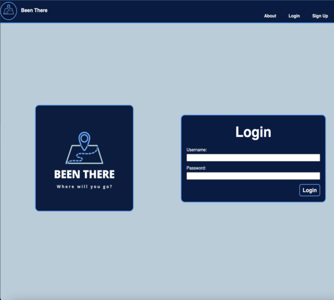

# Been-There

## Getting Started: 

Been There is the premier place to log your travels! Within the app, users can add destinations they have visited and track addtional visits to the same location. Users also have the ability to describe their experience while at their destination to capture the most important memories. 

[**Start logging your adventures here!**](https://been-there.fly.dev/)

[**Checkout my planning materials here!**](https://trello.com/b/3rAZxRGO/been-there)

## Technologies Used: 

- HTML
- JavaScript
- CSS 
- Python
- Django
- Docker
- Neon

## Why create Been There?:

The world is such a vast and beatiful place to explore. I wanted to create an app that was dedicated to capturing the memories we while exploring. I personally love to go on adventures and seeing all sorts of the things that our world has to offer. I hope this app will allow others to reflect on where they have been and the memories made there!

## Ice Box 

- Allow user to edit or delete a visit to a destination.
- Gallery feature where users can add multiple photos of their destination.
- Search functionality to find a destination. 
- Allow users to view other profiles and the destinations they have created
- Add comments to destinations

## Attributions 

- Images sourced from [**Canva**](https://www.canva.com/)
